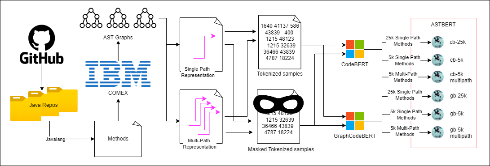
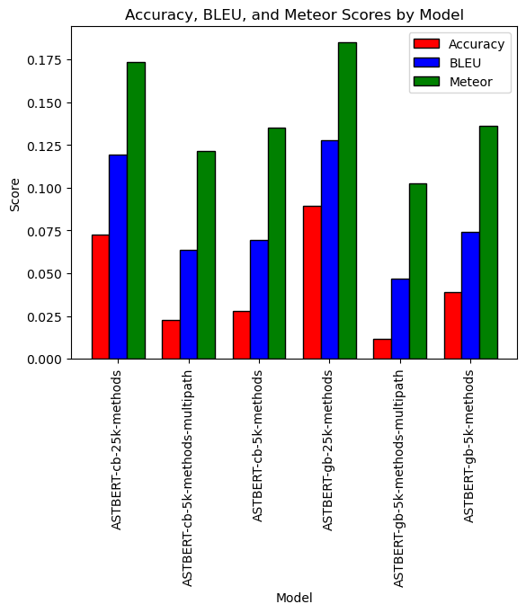
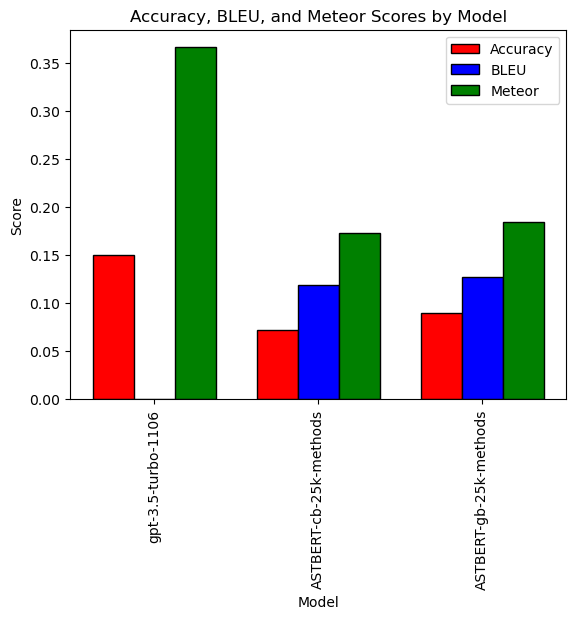
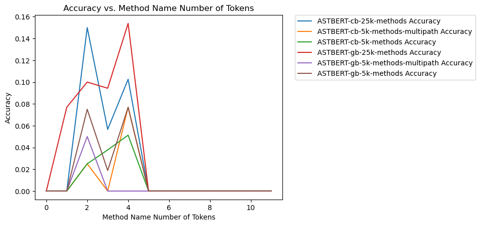
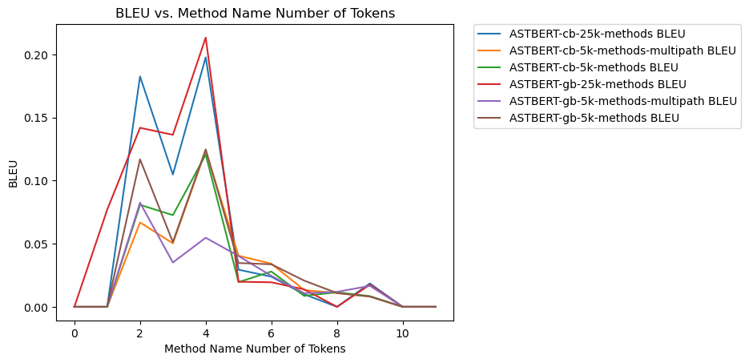
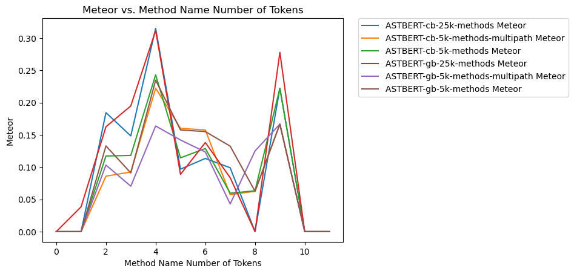
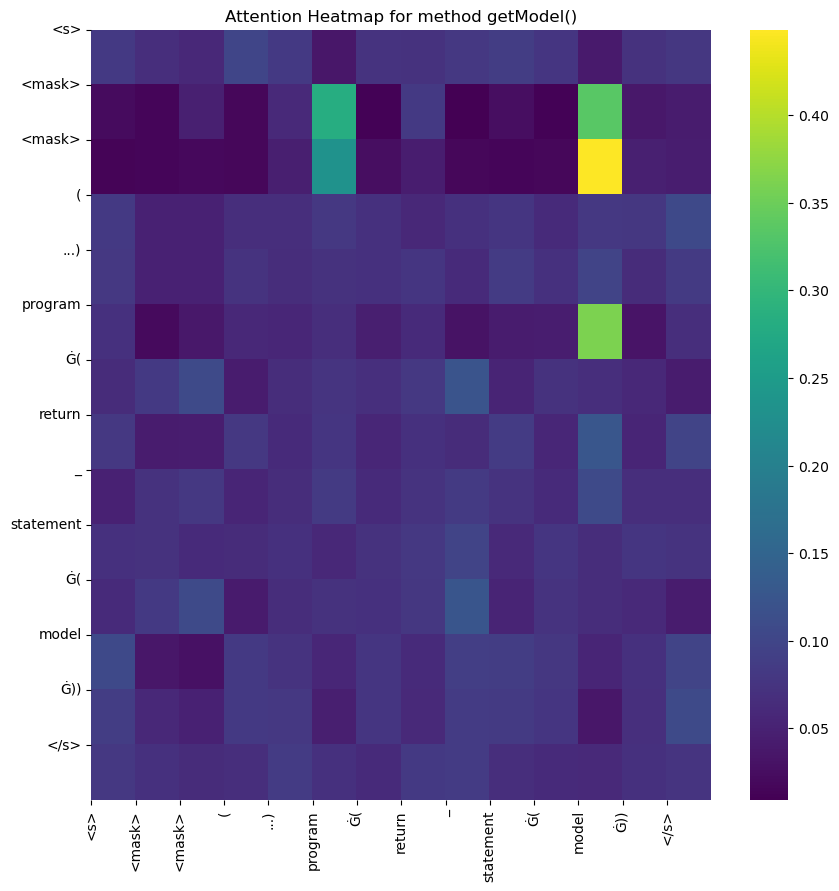

```
  .--.   .----..---. .----. .----..----.  .---. 
 / {} \ { {__ {_   _}| {}  }| {_  | {}  }{_   _}
/  /\  \.-._} } | |  | {}  }| {__ | .-. \  | |  
`-'  `-'`----'  `-'  `----' `----'`-' `-'  `-'  
```

# ASTBERT: Method Name Prediction Using AST (Abstract Syntax Tree) Representation with BERT Models



This repository contains a series of Jupyter notebooks for predicting method names using different AST representations and BERT models. The notebooks are designed to be run in sequence and will guide you through the process of gathering data, extracting methods, generating AST graphs, converting AST graphs to vectors, finetuning BERT models, and evaluating the models.

Fine tuned models can be found here: https://huggingface.co/JasperGrant

## Installation
- Download conda here: https://conda.io/projects/conda/en/latest/user-guide/install/index.html
- Download dot graph visualizer here: https://graphviz.org/docs/layouts/dot/
- Create a new venv with python version 3.8:
    ```
    conda create -n myenv python=3.8.0
    ```
- Install correct cuda and cudnn versions:
    ```
    conda install -c conda-forge cudatoolkit=11.2 cudnn=8.1.0
    ```
- Install requirements in venv:
  ```
  pip install -r requirements.txt
  ```
- Ensure the folder C:\Users\YOUR_USERNAME\AppData\Local\Temp\comex exists and is not read only

## Running Experiments

### Notebook 1: Data Gather

Specify number of repos to download and run all cells. Cloning the large repos sometimes can take a while. Repos will be clones into `data/repos` folder.

Used in finetuned models were the following 5 repos:

antlr/antlr4, apache/activemq, apache/camel, apache/cassandra, apache/commons-lang

These are currently the top choices with the parameters specified in the ghs-seart request.

### Notebook 2: Extract Methods

Run all cells. This will extract all methods from the downloaded repos and save them in the `data/methods.json` file.

Used in finetuned models were a randomly selected 25k and 5k of the methods extracted from the 5 repos.

### Notebook 3: Generate Graphs

Run all cells. This will generate the AST graphs for each method and save them in the `data/graphs` folder.

Used in finetuned models were a randomly selected 25k and 5k of the methods extracted from the 5 repos.

### Notebook 4: Graphs to Paths

Use the first cell in this notebook if dataset is too large. This will randomly select a subset of the methods to convert to paths. Specify whether the intended AST representation is single path or multipath by running either the second or third cell. This will convert the AST graphs to paths using the specified method and save them in the `data/paths.json` folder.

### Notebook 5: Finetune Model

In the model and tokenizer definition cell specify the preferred model to finetune. Both `microsoft/codebert-base-mlm` and `microsoft/graphbert-base` were tested in the finetuned modesls. Feel free to try out any other BERT model that can do mlm.
Next in the text_lst cell specify single or multi path AST representation. Run all cells to finetune the model.

### Notebook 6: Evaluate Model

Run all cells to observed results of the finetuned model on the test set. Results will be based on models deployed to Hugging face but can be changed to local models.

### Notebook 7: Model Playground

Here you can experiment with ASTBERT models directly from Hugging Face. The first cell allows you to enter source code and the second allows you to enter AST representation.

## Evaluation Results

### Overall



### Compared to GPT



### Metrics by Method Token Length







### Attention Heatmap



## Common issues

### Notebook 2: Extract Methods
- **Format error in methods.json** : Step 1 has been interrupted. Either rerun the notebook from the beginning or manually remove the last entry in methods.json

### Notebook 3: Generate Graphs
- **Permission Error**: Ensure the folder C:\Users\YOUR_USERNAME\AppData\Local\Temp\comex exists and is not read only

### Notebook 5: Finetune Model
- **CUDA Out of Memory**: Reduce the batch size in the model.compile function call.
- **Format error in paths.json**: Step 4 has been interrupted. Either rerun the notebook from the beginning or manually remove the last entry in paths.json

## Acknowledgements
Credit to Yuci Wang for being my co-author on this project
